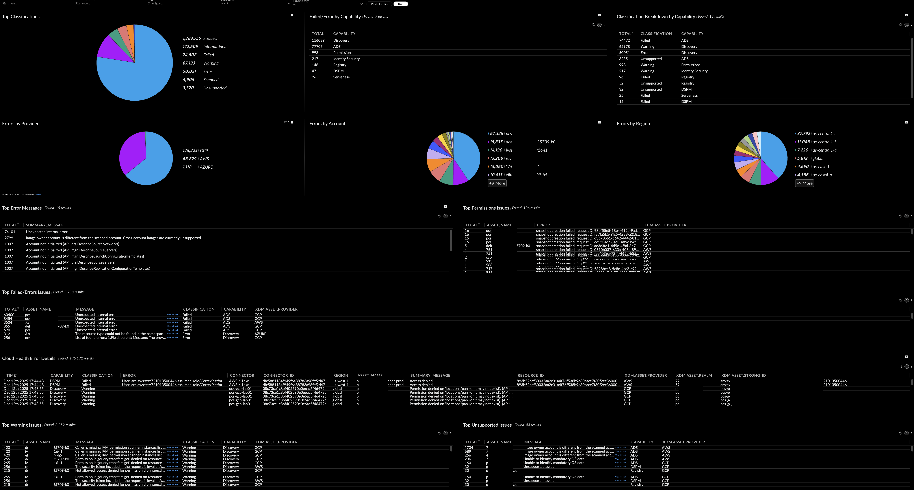

## CNAPP - Cloud Health Ingestion/Scan Status Dashboard

- [CNAPP - Container/VM Image Protection/Scan Status Dashboard](#cnapp---containervm-image-protectionscan-status-dashboard)
    - [Repository Files](#repository-files)
    - [Description](#description)
    - [Filters](#filters)
    - [Requirements](#requirements)
    - [Dashboard Screenshot](#dashboard-screenshot)

---

#### Repository Files

 | Files |  Description |
 |----|----|
 | [README.md](README.md) | Dashboard Description |
 | [dashboard.json](dashboard.json) | Dashboard JSON |
 | [dashboard.png](dashboard.png) | Dashboard Screenshot |

---

#### Description

This dashboard displays the most frequent Cloud Health auditing errors across providers, assets, regions, and error messages. Results join cloud_health_auditing with asset_inventory and support filtering by provider, realm, asset name, classification.

Pie charts drill downs are linked to filter values based on the selected chart option.

Cloud Health Error Details table (updated based on the filters) includes drill down to a URL for the selected asset detail in a new tab.

In order to see all messages - change the dashboard timeframe to see message beyond the default 24hr, e.g. last 30 days.

---

#### Filters

- Cloud Provider
- Account - Account/Subscription
- Region
- Capability
- Errors Only (Default - NO)

---

#### Dashboard Screenshot

