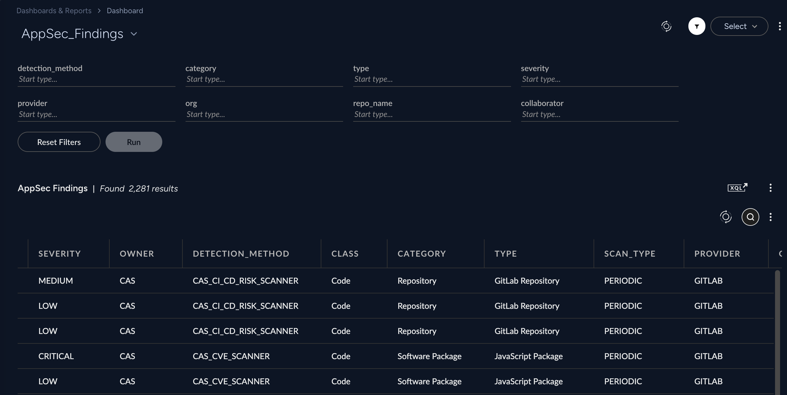

## CORTEX AppSec Findings Dashboard

- [CORTEX AppSec Findings Dashboard](#cortex-appsec-findings-dashboard)
    - [Repository Files](#repository-files)
    - [Description](#description)
    - [Widgets](#widgets)
    - [Filters](#filters)
    - [Requirements](#requirements)
    - [Dashboard Screenshot](#dashboard-screenshot)

---

#### Repository Files

 | Files |  Description |
 |----|----|
 | [README.md](README.md) | Dashboard Description |
 | [dashboard.json](dashboard.json) | Dashboard JSON |
 | [dashboard.png](dashboard.png) | Dashboard Screenshot |

---

#### Description

Cortex AppSec Findings view table with filters and download option

#### Widgets

- AppSec Findings table
  - Drill down to the repository detail view when clicked on any repository row in the table 

#### Filters

- detection_method
- category
- type
- severity
- repo provider
- repo org
- repo name
- collaborator

> [!NOTE]

---

#### Requirements

---

#### Dashboard Screenshot

