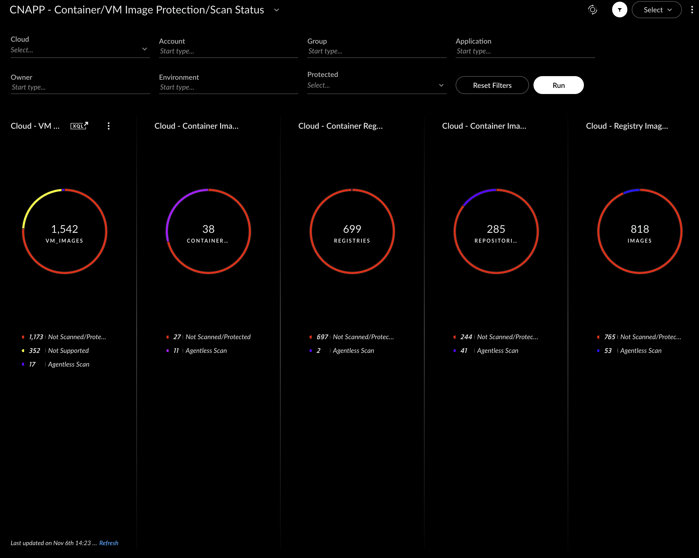

## CNAPP - Container/VM Image Protection/Scan Status Dashboard

- [CNAPP - Container/VM Image Protection/Scan Status Dashboard](#cnapp---containervm-image-protectionscan-status-dashboard)
    - [Repository Files](#repository-files)
    - [Description](#description)
    - [Filters](#filters)
    - [Requirements](#requirements)
    - [Dashboard Screenshot](#dashboard-screenshot)

---

#### Repository Files

 | Files |  Description |
 |----|----|
 | [README.md](README.md) | Dashboard Description |
 | [dashboard.json](dashboard.json) | Dashboard JSON |
 | [dashboard.png](dashboard.png) | Dashboard Screenshot |

---

#### Description

This dashboard displays the scan status of the discovered Container/VM Images: VM Images, Container Image Registries, Repositories and Container Images.

The primary goal is to understand which registries/repositories/images are not Scanned and plan the relevant Scan deployment.

Agentless Scan includes alls scan types, including registries scanned with Outpost/Broker VM deployments.

Filters to view workloads Scan status based on Cloud/Accounst, Scan/Protection status and predefined Tag values

Drilldowns are linked to XQL query search based on the Protected status.

Detailed tables for each widget are also provided.

- VM Images
  - Not Scanned/Protected - functions that are not Scanned by Agentless
  - Agentless Scan - Functions that have been scanned by Agentless
- Container Registry
  - Not Scanned/Protected - functions that are not Scanned by Agentless
  - Agentless Scan - Functions that have been scanned by Agentless

- Container Registry Reositories
  - Not Scanned/Protected - functions that are not Scanned by Agentless
  - Agentless Scan - Functions that have been scanned by Agentless

- Container Images
  - Not Scanned/Protected - functions that are not Scanned by Agentless
  - Agentless Scan - Functions that have been scanned by Agentless
---

#### Filters

- Cloud Provider
- Account - Account/Subscription
- Protected - (Protection/Scan Status)
- Tag1 - Current Value: Group_ID - Possible Options: Org/Group/BU
- Tag2 - Current Value: Application - Possible Options: Application
- Tag3 - Current Value: Application Owner - Possible Options: Owner
- Tag4 (filter values are normalised to upper case values) - Current Value: Environment - Possible Options: Environment/Business Criticality 
- Tag5 - Current Value: Function - Possible Options: Function/Business Use - Not displayed on the dashboard filters. Used for filtering out workloads that are not needed for Scanning or Protection (Vendor VM Applicance, such as Palo Alto NGFWs, Panorma, etc. - Update as required)

> [!NOTE]

---

#### Requirements

> [!IMPORTANT]
> Modify your required tag name values and Function/Business Use exceptions filters.

---

#### Dashboard Screenshot

