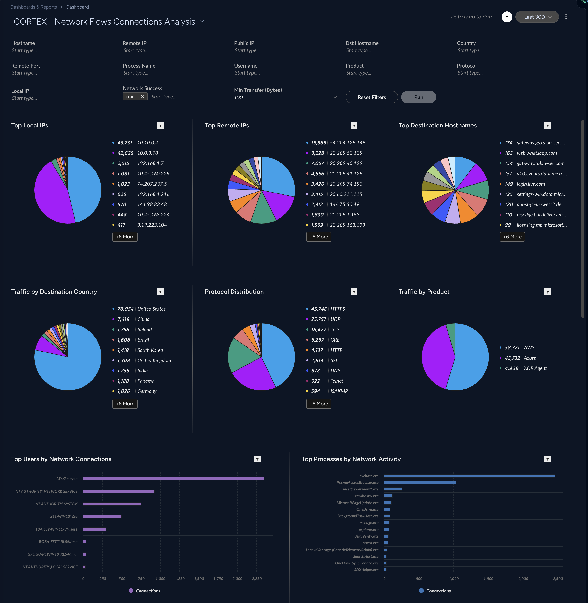
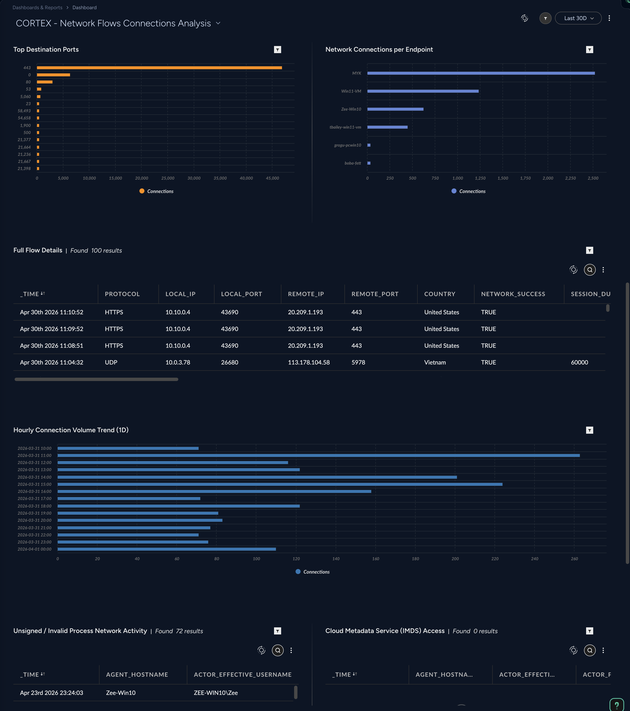

## CNAPP - Posture Issues Dashboard

- [CNAPP - Posture Issues Dashboard](#cnapp---posture-issues-dashboard)
    - [Repository Files](#repository-files)
    - [Description](#description)
    - [Filters](#filters)
    - [Dashboard Screenshot](#dashboard-screenshot)

---

#### Repository Files

 | Files |  Description |
 |----|----|
 | [README.md](README.md) | Dashboard Description |
 | [dashboard.json](dashboard.json) | Dashboard JSON |
 | [dashboard.png](dashboard.png) | Dashboard Screenshot |

---

#### Description

Network flow log analysis built on the network_story preset. Covers all traffic product types — geo-distribution, top processes, protocol analysis, port usage, hourly trends, unsigned process detection, IMDS access, causality chain anomalies, and full flow details.

This dashboard allows you to investigate network flows ingested with Flow Logs from Cloud providers, as well as network statistics from XDR agent ingestion.

Min transfer bytes filter can be used to filter out connections that do not exchange any data.

Pie charts drill downs are linked to filter values based on the selected chart option.

Detailed Full Flow Details table (updated based on the filters) is also provided with drill down to a URL for each selected asset detail in a new tab.

Use the filters and drilldowns to investigate you network flows and create Correlation Rules to detect suspicious network activities.

---

#### Filters

- Hostname (XDR Agent)
- Remote IP
- Public IP
- Dst Hostname  (XDR Agent)
- Country
- Remote Port
- Process Name (XDR Agent)
- Username (XDR Agent)
- Product - Data Ingestion Source (AWS/Azure/GCP/XDR Agent/Route53)
- Protocol
- Local IP
- Network Success (default - true)
- Min Transfer (Bytes) (default - 100)

> [!NOTE]

---

#### Dashboard Screenshot

