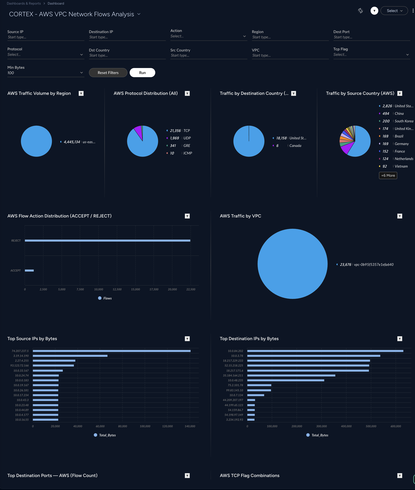
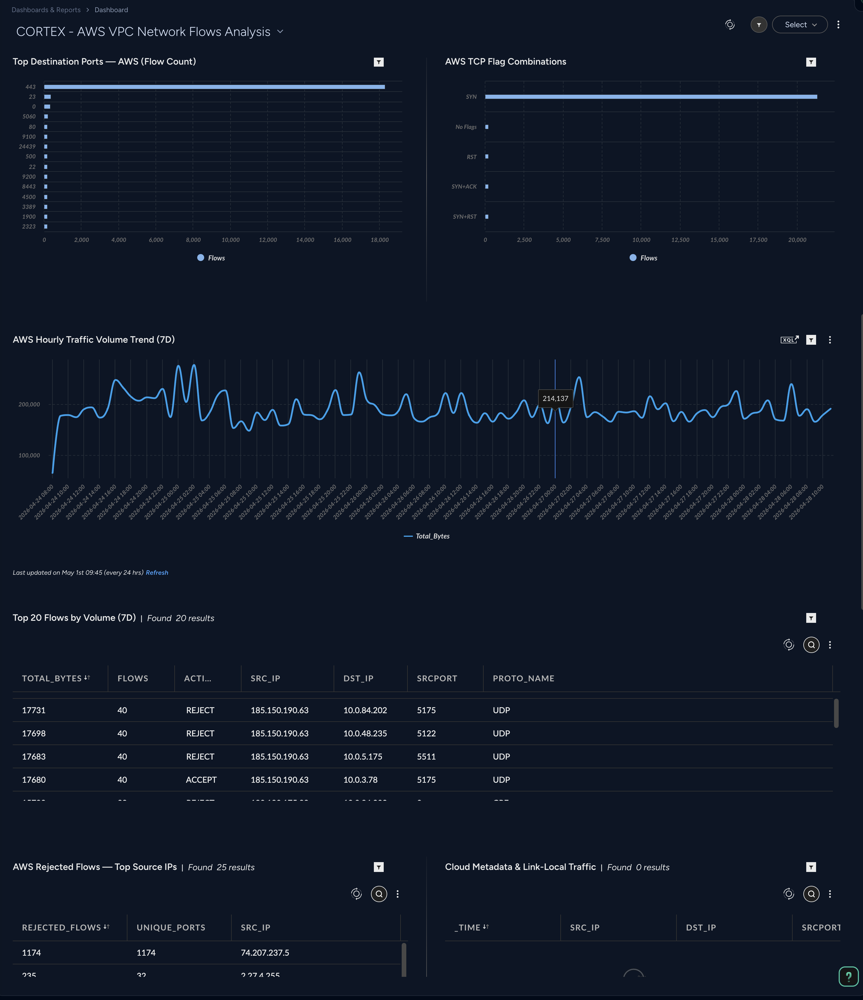

## CORTEX - AWS VPC Network Flows Analysis Dashboard

- [CORTEX - AWS VPC Network Flows Analysis Dashboard](#cortex---aws-vpc-network-flows-analysis-dashboard)
    - [Repository Files](#repository-files)
    - [Description](#description)
    - [Filters](#filters)
    - [Dashboard Screenshot](#dashboard-screenshot)

---

#### Repository Files

 | Files |  Description |
 |----|----|
 | [README.md](README.md) | Dashboard Description |
 | [dashboard.json](dashboard.json) | Dashboard JSON |
 | [dashboard.png](dashboard.png) | Dashboard Screenshot |
 | [dashboard1.png](dashboard1.png) | Dashboard Screenshot |

---

#### Description

Cloud VPC flow log analysis built on raw cloud audit logs (Cloud Flow Log filter). Covers AWS VPC Flow Logs (amazon_aws_raw) . Includes traffic volume, byte-level analysis, TCP flags, ACCEPT/REJECT breakdown, IMDS detection, geo-location, and full flow detail tables. Replaces network_story preset which lacked volume data and included rejected connections.

Min transfer bytes filter can be used to filter out connections that do not exchange any data.

Pie charts drill downs are linked to filter values based on the selected chart option.

Detailed Full Flow Details table (updated based on the filters) is also provided with drill down to a URL for each selected asset detail in a new tab.

Use the filters and drilldowns to investigate you network flows and create Correlation Rules to detect suspicious network activities.

---

#### Filters

- Source IP
- Destination IP
- Action
- Destination Port
- Protocol
- Destination Country
- Source Country
- VPC
- TCP Flag
- Min Transfer (Bytes) (default - 100)

> [!NOTE]

---

#### Dashboard Screenshot

