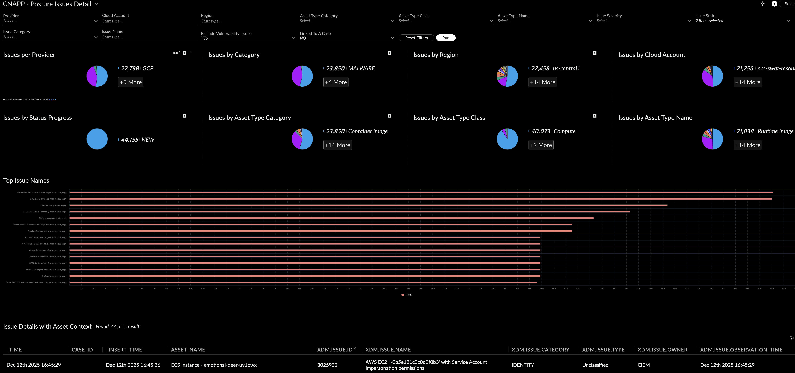

## CNAPP - Posture Issues Dashboard

- [CNAPP - Container/VM Image Protection/Scan Status Dashboard](#cnapp---containervm-image-protectionscan-status-dashboard)
    - [Repository Files](#repository-files)
    - [Description](#description)
    - [Filters](#filters)
    - [Requirements](#requirements)
    - [Dashboard Screenshot](#dashboard-screenshot)

---

#### Repository Files

 | Files |  Description |
 |----|----|
 | [README.md](README.md) | Dashboard Description |
 | [dashboard.json](dashboard.json) | Dashboard JSON |
 | [dashboard.png](dashboard.png) | Dashboard Screenshot |

---

#### Description

This dashboard displays Combined view of CNAPP posture issues with detailed breakdowns by severity, status, category, and asset context

Pie charts drill downs are linked to filter values based on the selected chart option.

Detailed table (updated based on the filters) for the assets widget is also provided with drill down to a URL for each selected asset detail in a new tab.

---

#### Filters

- Cloud Provider
- Account - Account/Subscription
- Region
- Asset Type Category/Class/Name
- Issue Severity/Status/Category/Name
- Exclude Vulnerabilities (Default - YES)
- Linked to a Case (Default - NO)
> [!NOTE]

---

#### Dashboard Screenshot

