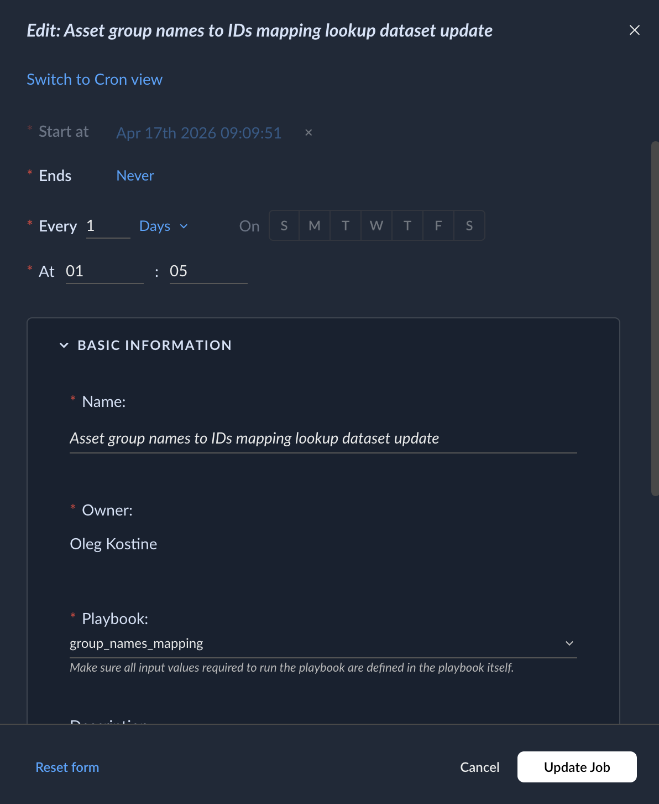
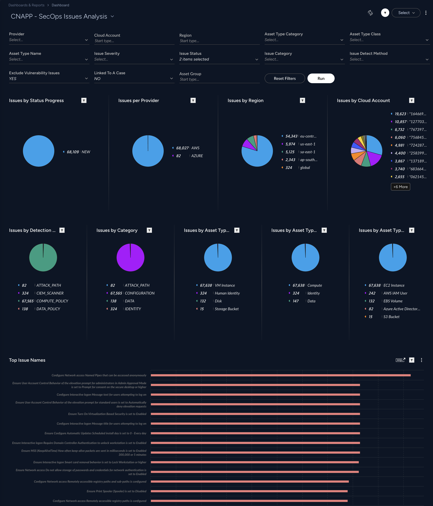

## CNAPP - SecOps Issues Analysis Dashboard (with Asset Group filter)

- [CNAPP - SecOps Issues Analysis Dashboard (with Asset Group filter)](#cnapp---secops-issues-analysis-dashboard-with-asset-group-filter)
    - [Repository Files](#repository-files)
    - [Description](#description)
    - [Filters](#filters)
    - [Dashboard Screenshot](#dashboard-screenshot)

---

#### Repository Files

 | Files |  Description |
 |----|----|
 | [README.md](README.md) | Dashboard Description |
 | [dashboard.json](dashboard.json) | Dashboard JSON |
 | [dashboard.png](dashboard.png) | Dashboard Screenshot |
 | [group_names_mapping-playbook.yml](group_names_mapping-playbook.yml) | Group mapping playbook |
 | [group_names_mapping-script.yml](group_names_mapping-script.yml) | Group mapping script |

---

#### Description

This dashboard displays Combined view of CNAPP posture issues with detailed breakdowns by severity, status, category, and asset context

Pie charts drill downs are linked to filter values based on the selected chart option.

Detailed table (updated based on the filters) for the assets widget is also provided with drill down to a URL for each selected asset detail in a new tab.

Asset Group filter added to enable Asset Group filter options based on the available Asset group names.

The Asset group names are retrieved from a custom lookup dataset that needs to be created and updated on a regular basis for any new asset group modifications.
The script and playbook are provided. The playbook requires input parameters for the instance fqdn, api_key_id and api_key. API Key input parameter is set as sensitive value (won't be visible after initial configuration) and needs to be added once when creating the playbook.
In XSIAM the Playbook can be added to Automation Jobs, in XDR instance - run an external script instead of a playbook to update the group_mapping lookup dataset with up to date asset group details.

#### Filters

- Cloud Provider
- Cloud Account - Account/Subscription
- Region
- Asset Type Category/Class/Name
- Issue Severity/Status/Category/Name
- Issue Detect Method
- Exclude Vulnerabilities (Default - YES)
- Linked to a Case (Default - NO)
- Asset Group
> [!NOTE]

---

#### Dashboard Screenshot

