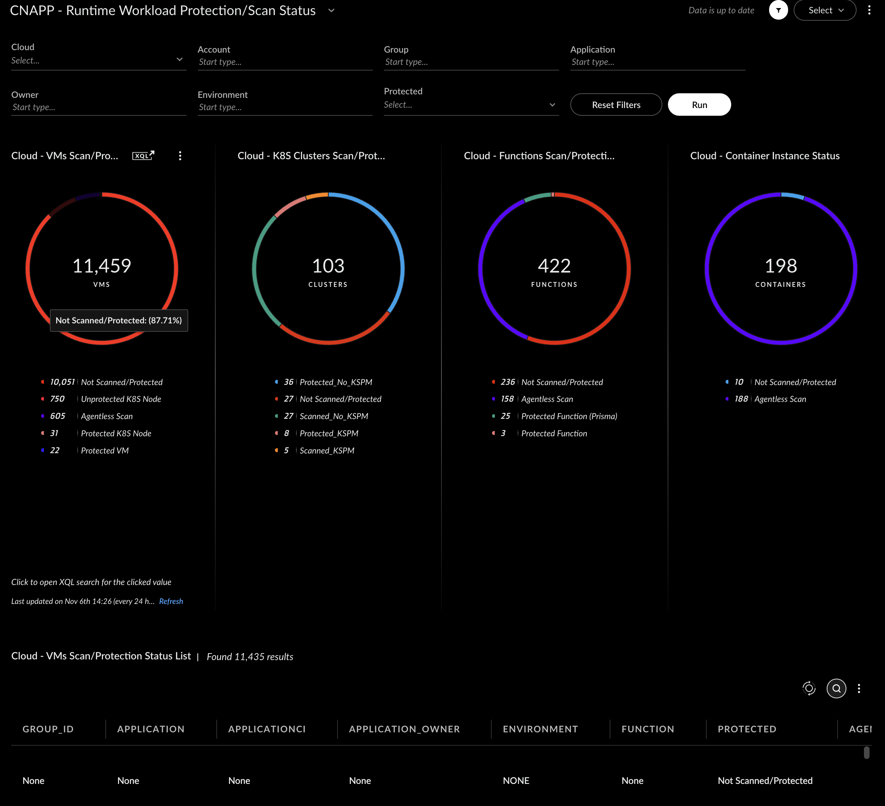

## CNAPP - Runtime Workload Protection/Scan Status Dashboard

- [CNAPP - Runtime Workload Protection/Scan Status Dashboard](#cnapp---runtime-workload-protectionscan-status-dashboard)
    - [Repository Files](#repository-files)
    - [Description](#description)
    - [Widgets](#widgets)
    - [Filters](#filters)
    - [Requirements](#requirements)
    - [Dashboard Screenshot](#dashboard-screenshot)

---

#### Repository Files

 | Files |  Description |
 |----|----|
 | [README.md](README.md) | Dashboard Description |
 | [dashboard.json](dashboard.json) | Dashboard JSON |
 | [dashboard.png](dashboard.png) | Dashboard Screenshot |

---

#### Description

Status of discovered VMs, K8S Clusters, Serverless Functions, Container Instances (Drift).

This dashboard displays the Scan/Protection status of the runtime resources onboarded onto the platform.

The primary goal is to understand which workloads are not Scanned/Protected and plan Scan/Protection deployment.

Filters to view workloads Scan/Protection status based on Cloud/Accounst, Scan/Protection status and predefined Tag values

Drilldowns are linked to XQL query search based on the Protected status.

Detailed tables for each widget are also provided. Tables data is updated with the applied filters.

#### Widgets

- VM Instances
  - Not Scanned/Protected - VMs that are not Scanned by Agentless or have an agent deployed
  - Protected VM - VM Instances with Cortex runtime agent
  - Agentless Scan - VMs that have been scanned by Agentless
  - Protected K8S Node - K8S Cluster nodes with Cortex runtime agent
  - Unprotected K8S Node - K8S Cluster nodes without agent
- K8S clusters
  - Not Scanned/Protected - K8S Clusters that are not scanned and do not have an agent deployed and not KSPM enabled
  - Protected_KSPM - Protected K8S Clusters (agent deployed on cluster nodes) with KSPM enabled
  - Protected_No_KSPM - K8S Clusters (agent deployed on cluster nodes) without KSPM enabled
  - Scanned_KSPM - Discovered K8S Clusters with KSPM enabled
  - Scanned_No_KSPM - Discovered K8S Clusters with KSPM enabled only

- Serverless Functions
  - Not Scanned/Protected - functions that are not Scanned by Agentless or have an agent deployed
  - Agentless Scan - Functions that have been scanned by Agentless
  - Protected Function - Serverless functions with Cortex agent (cortex.handler)
  - Protected Function (Prisma) - Serverless functions with Prisma agent (twistlock.handler)

- Container Instances
  - Not Scanned/Protected - Container Instances that are not Scanned by Agentless
  - Agentless Scan - Container Instances that have been scanned by Agentless
---

#### Filters

- Cloud Provider
- Account - Account/Subscription
- Protected - (Protection/Scan Status)
- Tag1 - Current Value: Group_ID - Possible Options: Org/Group/BU
- Tag2 - Current Value: Application - Possible Options: Application
- Tag3 - Current Value: Application Owner - Possible Options: Owner
- Tag4 (filter values are normalised to upper case values) - Current Value: Environment - Possible Options: Environment/Business Criticality 
- Tag5 (Not displayed on the dashboard filters.) - Current Value: Function - Possible Options: Function/Business Use -  Used for filtering out workloads that are not needed for Scanning or Protection (Vendor VM Applicance, such as Palo Alto NGFWs, Panorma, etc. - Update as required)

> [!NOTE]

---

#### Requirements

> [!IMPORTANT]
> Modify your required tag Name values and Function/Business Use exceptions filters.

---

#### Dashboard Screenshot

